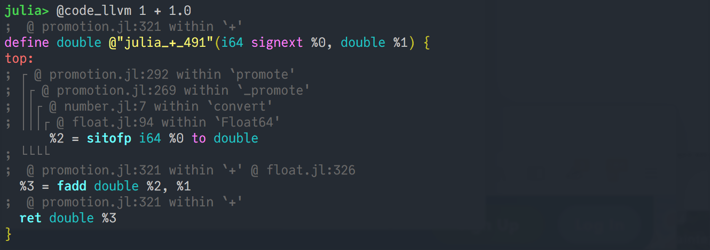
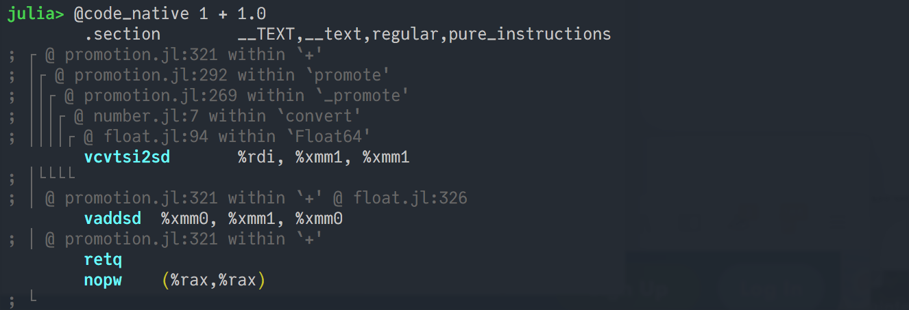

---

# Julia Advice for MATLAB (or R or Python) programmers

Here are a few things I've learned while transitioning from a mix of MATLAB and C to the [Julia](https://julialang.org) programming langage, starting around 2018. Some of this is rather straightforward, while other points may be less obvious.

The short, narrative, version is that a [multiple dispatch](https://en.wikipedia.org/wiki/Multiple_dispatch)-based programming language like Julia effectively brings with it a whole *dispatch-oriented* programming paradigm, which you have to embrace in order to really get the most out of Julia. Every function in Julia, all the way down to things like `+` (and even, e.g., `Base.add_int` below that) falls into a dispatch hierarchy, which you can freely extend. Julia is not the first language to have this (c.f. [Dylan](https://en.wikipedia.org/wiki/Dylan_(programming_language)), Common Lisp via [CLOS](https://en.wikipedia.org/wiki/Common_Lisp_Object_System)), but is one of if not *the* first to combine this with JAOT compilation to avoid runtime performance overhead and enable a notable combinatino of speed and interactivity. This programming paradigm brings with it both some advantages like [composability](https://www.youtube.com/watch?v=kc9HwsxE1OY), but also some new pitfalls to watch out for (particularly, [type-instability](https://www.johnmyleswhite.com/notebook/2013/12/06/writing-type-stable-code-in-julia/), which we will talk about more here below).

Meanwhile, some habits and code patterns that may be seen as "best practices" in languages like Matlab, Python, or R can be detrimental and lead to excess allocations in Julia (see, e.g., the sections about "vectorization" below, as well as about different ways of indexing on the RHS of an assignment), so it may almost be easier to switch to Julia and get good performance from day 1 if you are coming from a language like C where you are used to thinking about allocations, in-place methods, and loops being fast.


## The very basics:
There are many different ways of using Julia -- in an IDE (e.g. [Juno](https://junolab.org) or [Julia for VSCode](https://www.julia-vscode.org)), in a Jupyter notebook via [IJulia](https://github.com/JuliaLang/IJulia.jl), in a [Pluto notebook](https://plutojl.org), integrated with a command-line editor like Vim or Emacs, or just directly in the terminal. In any case though, you will likely end up interacting with a Julia *REPL*, where you can type in Julia code and get results back.

#### At the REPL,
* Typing `?` followed by the name of a function (or type, etc.) name will give you help/documentation on that function (or type, etc.).
  * This documentation is usually quite good, but you have to know the exact name of the thing you need. If you don't know that, try the `apropos` function to find the exact names of a few relevant things (try, for example `apropos("sparse array")`). You can also access these suggestions by entering a string rather than raw text at the `?` prompt.
  * Julia can be fast in part because it uses specialized versions of functions for different argument types. For example, sparse matrices in Julia (from the `SparseArrays.jl` package) are represented as a `SparseMatrixCSC` type, and `methodswith(SparseMatrixCSC)` shows methods which are specialized for `SparseMatrixCSC`. 
* Typing `]` opens the package manager
* Typing `;` gives you the system command line
* Typing `@less` or `@edit` followed by a function call will show you the source code for that function
* for more advanced REPL tips and tricks, see [this video](https://www.youtube.com/watch?v=EkgCENBFrAY)

#### Some quick-start guides/cheatsheets:
* A handy Matlab-Python-Julia rosetta stone: https://cheatsheets.quantecon.org/
* The ["Noteworthy Differences from other Languages" section](https://docs.julialang.org/en/v1.6/manual/noteworthy-differences/) of the official Julia docs
* "The fast track to Julia": https://juliadocs.github.io/Julia-Cheat-Sheet/

## Common 'gotcha's:
* if `A` is an array, **assigning** `B = A` will copy`A` *by reference* such that both `A` and `B` point to the same memory,  i.e., if you subsequently change `A[1]`, that'll also change `B[1]`. If you don't want this, you need to make a copy, e.g. `B = copy(A)`.
* Slicing an array by **indexing**, with (e.g.)  `x = a[:, 5]` or `a = x[x .> 5]`, etc., *makes a copy*. This is great if you *want* a brand new array, but can be slow if you don't. In the latter case, you can instead use a [`view`](https://docs.julialang.org/en/latest/base/arrays/#Base.view), e.g. `view(a, :, 5)`, which will be much much faster where applicable.
  * You can turn array-style indexing into a view with the `@views` macro (`@views a[:, 5]` equals `view(a, :, 5)`).
* For **element-wise** operations on an array, you put a dot on _every_ function/operator (not just a some, as in Matlab).
  * This includes functions you call with `()`. For example, `f.(x)` is different than `f(x)`.
  * This known as **dot-broadcasting**, and can be done for just about any function or operator.
* Extending the above, `.=` is different than `=`. To use  `.=` the variable on the left of the assignment must already exist and be the right size. If it does though, `.=` will be much more efficient than `=` since it will fill the already-existing array rather than allocating a new one.
  * If you don't want to write all the dots, you can use the `@.` macro. `@. r  = a * b + sin(c)` is equivalent to `r .= a .* b .+ sin.(c)`. In either case, if you have "dot-broadcasting" for every operation in a line the whole thing will get "fused" with sometimes-significant performance gains.
* For **timing** things (in the context of optimizing performance), you generally want to use `@btime` (from [BenchmarkTools.jl](https://github.com/JuliaCI/BenchmarkTools.jl)), not `@time`, and unless you're timing something that will always be called in global scope you probably want to "interpolate" any global variables into the `@btime` macro with `$`  (e.x. `@btime somefunction($some_array)`)
* One other minor point: in Julia, you generally don't use `printf`. Instead you can interpolate variables into strings with `$` and use plain old `print` (or `println`), ex:
  ```julia
  julia> x = 5; y = 7;
  julia> print("The values varied from $x to $y")
  The values varied from 5 to 7
  ```
* For more details, see the excellent articles on [Julia Antipatterns](https://www.oxinabox.net/2020/04/19/Julia-Antipatterns.html) by Lyndon White or [7 Julia Gotchas](http://www.stochasticlifestyle.com/7-julia-gotchas-handle/) by Chris Rackauckas

## Performance:
(see also: https://docs.julialang.org/en/v1/manual/performance-tips/)
* **_Loops_** are fast in Julia. It sounds simple but it was hard to really believe / to unlearn my Matlab instincts. In particular, an `@inbounds for` loop doing simple arithmetic operations, array indexing, or really anything that's *type-stable*, should run at C-like speeds.
  * Type-stable, non-allocating loops are just as fast as broadcasting (if not faster!)

* **_Type-stability_**: Use `@code_warntype` followed by a function call to check for type-stability (anywhere it prints a red `Any` is bad). Type-stable code is, perhaps, two orders of magnitude faster than type-unstable code (though even type-unstable code may be faster than Python :p). If the `@code_warntype` output is overwhelming, start by just looking at the list of variables at top and try to make sure they're all green concrete types and not red `Any`s.
  * !However: putting restrictive type assertions on function arguments doesn't make the function faster, and is more useful for dispatch than for anything to do with type stability. Instead, type-stability is all about avoiding cases where instability is introduced in the first place, and if you can't then sanitizing any unstable things (like variables pulled from a `Dict`) with a typeassert (e.g. `x::Array{Float64,1}`) prior to using them (in fact, probably better to avoid `Dict`s altogether except perhaps for interactive use)
    * See also: [JET.jl](https://github.com/aviatesk/JET.jl), [Cthulhu.jl](https://github.com/JuliaDebug/Cthulhu.jl) as discussed below

* **_Allocations_**: Allocating memory takes time, and if you have a whole lot of allocations, that makes work for the garbage collector, which take even more time. It's _very easy_ to accidentally write code that allocates when it really doesn't have to (e.g., the examples above in the "gotcha's" section about indexing on the RHS of an assignment (vs using a `view`), or about `=` vs. `.=`. Fortunately, it's very easy to check, since `@allocated`, `@time`, `@btime`/`@benchmark` can all be used to check how much memory your code allocates. Also, as it turns out, many named functions already have _in-place_ (i.e., non-allocating) versions that mutate their arguments. These should have names that end in `!`, since Julia convention is that any function which mutates its arguments must end in `!`. So for example `fill` versus `fill!`.

* **_Vectorization_** is used to refer to two very different concepts in CS, both of which occur in Julia. One is a syntax thing, the other is a hardware thing. The syntax kind is what you know from Matlab (essentially what we discussed as "broadcasting" above), the hardware kind is about the amazing things you can do with your CPU's vector registers / avx extensions (basically like a mini GPU within your CPU), which you can access with [LoopVectorization.jl](https://github.com/JuliaSIMD/LoopVectorization.jl).  
  * You can use [LoopVectorization.jl](https://github.com/JuliaSIMD/LoopVectorization.jl) either on a loop with `@turbo for`, or on a dot-broadcasted operation with `@turbo  @.` You can only use this in cases where the iterations of the loop can be conducted in arbitrary order, since the vector registers will be running the same operations on several iterations of your loop at the same time.
  * See also [`@simd`](https://docs.julialang.org/en/v1/base/base/index.html#Base.SimdLoop.@simd), though `@turbo` is generally faster when applicable

* To **_follow the compilation pipeline_** and see how your Julia code is being translated into intermediate representations, and finally machine code, you can use several handy macros. This is something you may not be used to being able to do from Matlab or Python, but it can be quite instructive when trying to understand and optimize your code!
  * `@code_lowered` -- Prints Julia SSA-form IR
  
  In order to add `1` (an integer) and `1.0` (a floating point number), Julia must first promote the two to a consistent type. This is what the call to `Base.promote_type` does. Then we add (in a slightly funny way), and return the result. To see why we add this way, let's look one step deeper

  * `@code_warntype` -- like `@code_lowered`, but also shows type-inference information
  
  Ok, so now we can see they types of everything as well, in the colored type annotations beginning with `::`. The inputs are `x` which we are told is an `Int64`, (evidently our 1), and `y` which is a `Float64` (our 1.0). After applying `Base.promote_type`, the result is a tuple of two `Float64`s, in this case `(1.0, 1.0)`. Tuples are arguably one of the most fundamental constructs in Julia (thanks to its Lisp-y heritage), and have lots of nice properties. Among other things, they're [iterable](https://docs.julialang.org/en/v1/manual/interfaces/#man-interface-iteration), so the natural way to add up the contents of one is by iterating. That's what the next line here does, iteratively applying `Base.:+` over our tuple. This might seem a bit like overkill here, but you can imagine how this would generalize nicely if we had been adding more than just two things. So this is all fine and well, but our CPU can't run these Julia instructions, so let's keep going.

  * `@code_llvm`  --   Prints LLVM bitcode
  
  The next step in Julia's compilation pipeline is to turn everything into [LLVM](https://en.wikipedia.org/wiki/Llvm) IR, which LLVM will use to generate the final optimized machine code. There are three instructions here: first `sitofp`, which as the "i to f" part might tell you, is going to convert an integer to a floating point number. Then, `fadd`, which will add two floating point numbers, and finally we'll `ret`urn the result.

  * `@code_native` --  Prints native assembly code
  
  There's a bunch of greyed-out contextual information here again, but the important parts -- this time native x86 instructions which can actually run on our CPU -- are highlighed again. The first one `vcvtsi2sd` is a bit of a mouthful, but this is our integer-to-float conversion again. Then we have `vaddsd`, which is going to "Vectorized ADD Scalar Double-precision floating-point values" from registers `xmm0` and `xmm1`, and store the results in register `xmm0`. Then `retq` to return control, and `nopw` (a no-op), which is just padding for alignmnent.

    One thing you might notice, if you're used to reading x86 assembly, from the `v` in front of the instructions, and the `x` in the register names, is that this is vectorized code. This isn't doing much for us in this case since we're only adding one pair of numbers, but this is a hint that we could actually add several numbers at once with only a single one of these `vadd` instructions, e.g.:
  
  Julia's compilation pipleine isn't bad at vectorizing things like this, but won't catch everything; and for everything else there's LoopVectorization.jl.

* `@descend` from [Cthulhu.jl](https://github.com/JuliaDebug/Cthulhu.jl) -- don't let the name scare you off; it's basically just an interactive version of the above three, that lets you switch between representations and interactively walk down (and back up) into the other functions inside your function.

## Tooling

* Testing: the built-in testing framwork, [Test](https://docs.julialang.org/en/v1/stdlib/Test/) is relatively bare-bones but simple to use and nicely integrated with the built-in package manager [Pkg](https://docs.julialang.org/en/v1/stdlib/Pkg/). CI via Github Actions (e.g. [julia-runtest](https://github.com/julia-actions/julia-runtest)) is also pretty simple.

* Package management: [Pkg](https://docs.julialang.org/en/v1/stdlib/Pkg/) is excellent and makes it trivial to set up virtual environments. 

* Debugging: Julia provides several debugging utilities. One that is very similar to Matlab's interactive debugger (e.g., using `keyboard` to set breakpoints) is [Infiltrator.jl](https://github.com/JuliaDebug/Infiltrator.jl), which introduces `@infiltrate` as a replacement for `keyboard`. Personally, I've always been more a fan of good old `println` debugging though so can't really provide too much insight on debuggers. I do use [Cthulhu.jl](https://github.com/JuliaDebug/Cthulhu.jl) quite extensively for debugging these days, though I suppose not quite in the manner that one typically uses a debugger. 

* Static analysis: [JET.jl](https://github.com/aviatesk/JET.jl)


